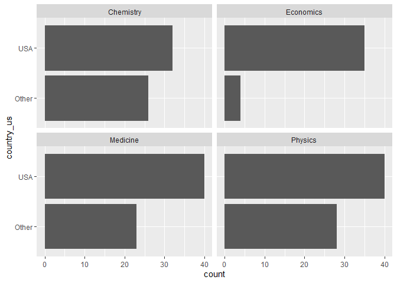
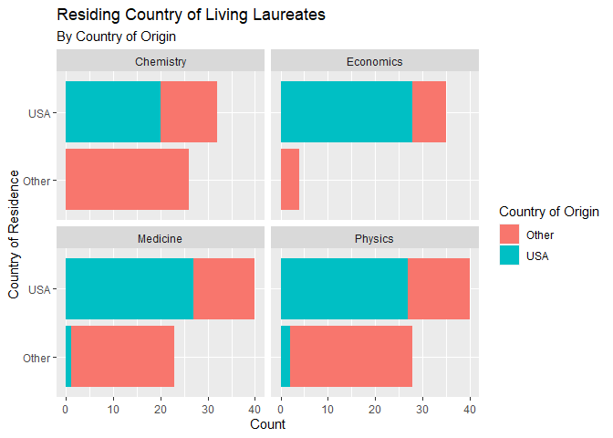

Lab 03 - Nobel laureates
================
Fanyi Zeng
01/30/22

### Load packages and data

``` r
library(tidyverse) 
```

``` r
nobel <- read_csv("data/nobel.csv")
```

## Exercises

### Exercise 1

935 observations (rows) of 26 variables (columns)

``` r
view(nobel)
```

### Exercise 2

filter out recipients who have no country data, who are organizations,
and who have passed away.

``` r
nobel_living <- nobel %>%
  filter(!is.na(country),
         gender != "org",
         is.na(died_date))
view(nobel_living)
```

### Exercise 3

sort country where the recipients live at the time of receiving the
prize to US vs. other

``` r
nobel_living <- nobel_living %>%
  mutate(country_us = if_else(country == "USA", "USA", "Other"))
```

filter out non-science prizes

``` r
nobel_living_science <- nobel_living %>%
  filter(category %in% c("Physics", "Medicine", "Chemistry", "Economics"))
```

create a faceted bar plot visualizing the relationship between the
category of prize and whether the laureate was in the US when they won
the nobel prize

``` r
ggplot(data = nobel_living_science, aes(y = country_us)) +
  geom_bar() +
  facet_wrap(~category)
```

<!-- -->

True, even by each prize category, most living laureates are from the
US.

### Exercise 4

sort ppl into us-born vs. other 105 rows of us-based laureates

``` r
nobel_living_science <- nobel_living_science %>%
  mutate(born_us = if_else(born_country == "USA", "USA", "Other") )
nobel_living_science %>%
  filter(born_us == "USA")
```

    ## # A tibble: 105 x 28
    ##       id firstname  surname  year category affiliation  city  country born_date 
    ##    <dbl> <chr>      <chr>   <dbl> <chr>    <chr>        <chr> <chr>   <date>    
    ##  1    95 Leon N.    Cooper   1972 Physics  Brown Unive~ Prov~ USA     1930-02-28
    ##  2   103 Ben R.     Mottel~  1975 Physics  Nordita      Cope~ Denmark 1926-07-09
    ##  3   106 Samuel C.~ Ting     1976 Physics  Massachuset~ Camb~ USA     1936-01-27
    ##  4   107 Philip W.  Anders~  1977 Physics  Bell Teleph~ Murr~ USA     1923-12-13
    ##  5   112 Robert Wo~ Wilson   1978 Physics  Bell Labora~ Holm~ USA     1936-01-10
    ##  6   113 Sheldon    Glashow  1979 Physics  Harvard Uni~ Camb~ USA     1932-12-05
    ##  7   115 Steven     Weinbe~  1979 Physics  Harvard Uni~ Camb~ USA     1933-05-03
    ##  8   138 Jerome I.  Friedm~  1990 Physics  Massachuset~ Camb~ USA     1930-03-28
    ##  9   143 Russell A. Hulse    1993 Physics  Princeton U~ Prin~ USA     1950-11-28
    ## 10   144 Joseph H.  Taylor~  1993 Physics  Princeton U~ Prin~ USA     1941-03-29
    ## # ... with 95 more rows, and 19 more variables: died_date <date>, gender <chr>,
    ## #   born_city <chr>, born_country <chr>, born_country_code <chr>,
    ## #   died_city <chr>, died_country <chr>, died_country_code <chr>,
    ## #   overall_motivation <chr>, share <dbl>, motivation <chr>,
    ## #   born_country_original <chr>, born_city_original <chr>,
    ## #   died_country_original <chr>, died_city_original <chr>, city_original <chr>,
    ## #   country_original <chr>, country_us <chr>, born_us <chr>

### Exercise 5

add a second variable to your visualization from Exercise 3 based on
whether the laureate was born in the US or not

``` r
ggplot(data = nobel_living_science, aes(y = country_us, fill = born_us)) +
  geom_bar() +
  facet_wrap(~category) +
  labs(
    x = "Count",
    y = "Country of Residence",
    fill = "Country of Origin",
    title = "Residing Country of Living Laureates",
    subtitle = "By Country of Origin"
  )
```

<!-- -->

Not true. Most USA-based laureates are born in the USA.

### Exercise 6

``` r
nobel_living_science %>%
  filter(country_us == "USA", born_us == "Other") %>%
  count(born_country) %>%
  arrange(desc(born_country))
```

    ## # A tibble: 21 x 2
    ##    born_country       n
    ##    <chr>          <int>
    ##  1 United Kingdom     7
    ##  2 Ukraine            1
    ##  3 Turkey             1
    ##  4 Taiwan             1
    ##  5 Sweden             1
    ##  6 South Africa       1
    ##  7 Scotland           1
    ##  8 Norway             2
    ##  9 Mexico             1
    ## 10 Lithuania          1
    ## # ... with 11 more rows
